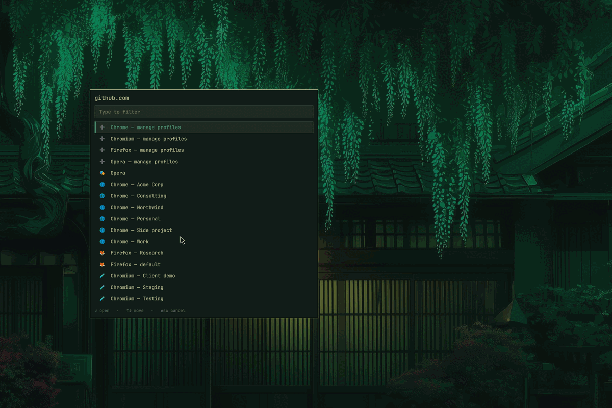
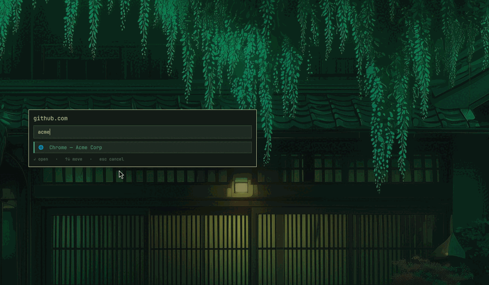

# Browser Picker

Every link asks which browser and which profile. Answer once per site and it
stops asking.



_Screenshots use invented profile names._

## Why

One browser profile per client, per project, per identity is normal now, and
nothing on the desktop knows about it. A link from Slack lands in whichever
profile the browser happened to have open, and moving it means copying the URL
into the right window by hand.

This makes that choice explicit and then learns it. Pick the work profile for
`atlassian.net` three times and the picker offers to remember; after that the
link just opens where it belongs.

## Install

```bash
omarchy plugin add https://github.com/K53N0/omarchy-browser-picker.git --enable
omarchy restart shell
```

The restart matters: a newly installed overlay does not get loaded by
`rescanPlugins` alone.

Then make it the default browser — click the bar entry and press **Set as
default browser**, or from a terminal:

```bash
~/.config/omarchy/plugins/k53n0.browser-picker/bin/browser-picker --set-default
```

This is not done at install time because `omarchy plugin add` never runs plugin
code, by design. Until it is done, the picker only handles `SUPER+SHIFT+B` and
the bar entry, not links clicked in other applications.

Needs `jq` and, for the fallback described below, `fzf` and `foot`. Omarchy
ships all three.



## Keys

| Key | |
|---|---|
| any text | filter, fzf-style — `chdes` finds `Chrome — Design Studio` |
| `↑` `↓` | move |
| `Enter` | open in the highlighted profile |
| `Ctrl+Enter` | open, and always open this site here from now on |
| `Esc` | cancel, opening nothing |

Clicking outside the card cancels too.

## Rules

A rule sends one site to one profile without asking. They accumulate three ways:

- **Learned.** After the same site goes to the same profile three times, the
  footer offers `Ctrl+Enter` to make it permanent. Nothing is written until you
  press it.
- **By hand.** Edit `~/.config/omarchy/browser-picker.json`.
- **Imported.** A `~/.config/browser-chooser/rules` file from the bash chooser
  this replaces is read once, on first run, if you have no rules yet.

A bare domain covers its subdomains, so `example.com` also matches
`portal.example.com`. Write `*.example.com` to match the subdomains only. The
most specific rule wins regardless of the order they appear in.

Every rule, learned or hand-written, is listed in the bar entry with a `✕` next
to it. **Apply rules automatically** turns the whole mechanism back into
ranking hints, which is the gentler way to live with rules you are not sure
about yet.

## Ranking

The unfiltered list is banded. The **manage profiles** rows come first — they
are what you reach for deliberately, and hunting for them past forty entries is
worse than passing them on the way down. Then browsers with no separate
profiles, a plain Firefox or an Opera with a single account, because otherwise
the simplest choice is scattered alphabetically among the named ones and ends
up the hardest to find. Both bands are toggles in the bar entry, **Manage rows
first** and **Plain browsers first**.

The bands apply only while the list is unfiltered. As soon as you type,
relevance wins — otherwise searching `chrome` would surface `Chrome — manage
profiles` above every actual Chrome profile.

Within a band, profiles are ordered by how you have actually used them:
recent choices outrank old ones, and a profile you have used *for this site*
outranks one you use constantly elsewhere. With more than a handful of
profiles this is most of the value — the right answer is usually in the first
three rows rather than halfway down an alphabetical list.

The counts live in `~/.local/state/omarchy/browser-picker.json`. Deleting that
file resets the ordering and nothing else.

## Supported browsers

Detected by presence, so only what you actually have installed appears.

- **Chromium family**, profiles read from `Local State`: Chrome, Chromium,
  Brave, Vivaldi, Edge, Opera, Helium, Ungoogled Chromium, Thorium.
- **Firefox family**, profiles read from `profiles.ini`: Firefox, Zen,
  LibreWolf, Floorp, Waterfox.

Each browser also gets a **manage profiles** row, which opens its own profile
screen.

Private browsing is translated per family, so Omarchy's `--private` reaches
Firefox as `--private-window` and Chromium as `--incognito`.

## Configuration

`~/.config/omarchy/browser-picker.json`, watched, so edits apply without a
restart.

```json
{
  "version": 1,
  "settings": {
    "autoOpenRules": true,
    "learnRules": true,
    "promptAfter": 3,
    "genericFirst": true,
    "manageFirst": true
  },
  "rules": [
    { "pattern": "example.com", "entryId": "chromium:Profile 19", "learned": false }
  ]
}
```

`entryId` is `<binary>:<profile-directory>` for the Chromium family and
`<binary>:<profile-name>` for the Firefox family. `bin/browser-picker-scan`
prints every id it knows:

```bash
~/.config/omarchy/plugins/k53n0.browser-picker/bin/browser-picker-scan | jq -r '.entries[].id'
```

## When the shell is down

The default browser is the worst thing to have broken, so there is a second
path. If `omarchy-shell` does not answer, the picker falls back to `fzf` in a
floating `foot` window: no ranking, no rules, just the list. Links keep
opening through a shell crash, a restart, or a login where the shell has not
come up yet.

## How it works

`bin/browser-picker` is what the `.desktop` file points at, and it is
deliberately thin. It hands the request to the plugin over shell IPC and
launches whatever comes back. Every decision — rules, ranking, learning —
happens in `Picker.qml`, so there is one implementation of each rather than one
in QML and another in bash.

The reply crosses back as a ready-to-run argv, NUL-separated, rather than a
name to be re-resolved. A profile called `He said "hi"` or `a; rm -rf ~`
survives the trip as a single argument, because nothing on the path ever
re-parses it as shell input.

## Remove

```bash
omarchy plugin remove k53n0.browser-picker
xdg-settings set default-web-browser <your-browser>.desktop
```

Rules and rankings are left behind. To remove those too:

```bash
rm -f ~/.config/omarchy/browser-picker.json \
      ~/.local/state/omarchy/browser-picker.json \
      ~/.local/share/applications/browser-picker.desktop
```

## Development

```bash
node test/test_model.js
bash test/test_scan.sh
omarchy plugin validate .
qmllint -I /usr/share/omarchy/shell -I . *.qml
omarchy restart shell
```

`Model.js` holds every decision as a plain function over plain data, which is
why the tests need no framework and no `node_modules`. `qmllint` exits non-zero
with no diagnostic on any out-of-tree plugin that registers an `IpcHandler`;
that is a limitation of the linter, not a finding.

MIT.
